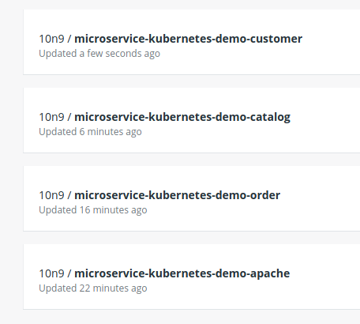

# Practical exercise for Chapter 2: Architectures
Student name: Doan Cao Thanh Long

Student ID: 20162513

Class: ICT-02.k61

## Question 1: Commands used to push the microservices
My DockerHub account username: 10n9

Service *Order*
```
# docker build --tag=microservice-kubernetes-demo-order microservice-kubernetes-demo-order
# docker tag microservice-kubernetes-demo-order 10n9/microservice-kubernetes-demo-order
# docker 10n9/microservice-kubernetes-demo-order
```

Service *Catalog*
```
# docker build --tag=microservice-kubernetes-demo-catalog microservice-kubernetes-demo-catalog
# docker tag microservice-kubernetes-demo-catalog 10n9/microservice-kubernetes-demo-catalog
# docker 10n9/microservice-kubernetes-demo-catalog
```

Service *Customer*
```
# docker build --tag=microservice-kubernetes-demo-customer microservice-kubernetes-demo-customer
# docker tag microservice-kubernetes-demo-customer 10n9/microservice-kubernetes-demo-customer
# docker 10n9/microservice-kubernetes-demo-customer
```

## Question 2: Repository on DockerHub account
After pushing the services, my public DockerHub account has 4 new repositories.



## Question 3: Status of Pods
Right after creating, the Pods all have status "ContainerCreating". After a few minutes, some Pods are terminated and all the others are "Running".

## Question 4: Role of Glassfish
Glassfish is a webserver to deploy web applications.

## Question 5: Reasons to create 2 JNDI
JNDI *myTopic* is to create mediator Topic, while JNDI *myTopicConnectionFactory* is to create connections between subscribers, publishers and Topic.

## Question 6: Message passing method of Sender and Receiver
Event-based architecture consists of subscriber and publisher. In the message passing method, the Sender is the publisher and the Receiver is the subscriber. These 2 components are independent and has no constraint between each other.

## Question 7: JMS vs DDS
+ Both has publish-subscribe architecture
+ Both are platform independence
+ JMS
    + JNDI and JMS servers must be specified and configured
    + Generic objects and XML are not type safe
    + Limited ability to tailor communications
    + Does not have interoperability
    + Limited in Java language
+ DDS
    + Has Dynamic Discovery, no need to specify endpoints
    + Strong type safety
    + QoS policies allow foe easy tailoring of communication behaviors
    + Open standard with proven interoperability
    + Available in various languages (C++, C#, Java, etc.)
