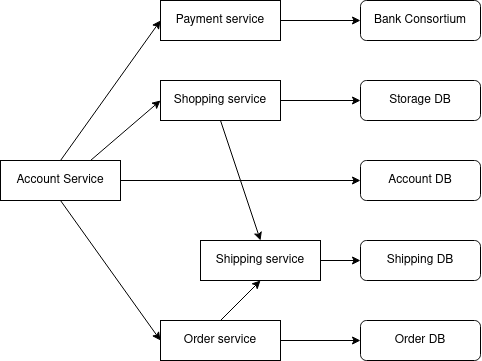

# Theoretical Exercises for Chapter 2: Architectures
Student name: Doan Cao Thanh Long

Student ID: 20162513

Class: ICT-02.k61

### Question 1: If a client and a server are placed far apart, we may see network latency dominating overall performance. How can we tackle this problem?
To tackle this problem, we have 3 approaches

- Divide responses into pieces with suitable sizes which can be issued independently. With this way, we can issue the received parts without waiting for the whole.
- Store by replicating the unsensitive but frequently called parts in nearby clients or servers.
- Schedule client's work efficiently, allow the client to do its job while waiting the response from the server.

### Question 2: What is a three-tiered client-server architecture?
A three-tiered client-server architecture is a centralized architecture consists of 3 main layers

- User interface layer: Users interact with the application by request and response.
- Processing layer: Implement the application.
- Data layer: Store all the data of the application.

### Question 3: What is the difference between a vertical distribution and a horizontal distribution?
- Vertical distribution: distribution of layers in a multitiered architecture across multiple machines. Each layer is often implemented on a different machine.
- Horizontal distribution: distribution of a single layer across multiple machines.

### Question 4: In a structured overlay network, messages are routed according to the topology of the overlay. What is an important disadvantage of this approach?
This approach does not account for physical location of the nodes. For instance, two nodes may have huge distance between them, yet they are neighbors in the topology.

### Question 5: Consider a chain of processes P1, P2, ..., Pn implementing a multitiered client-server architecture. Process Pi is a client of process Pi+1, and Pi will return a reply to Pi-1 only after receiving a reply from Pi+1. What are the main problems with this organization when taking a look at the request-reply performance at process P1?
The request-reply performance at process P1 is heavily depend on other processes in the system. If one process perform badly, the overall performance of the system will be affected. If one process does not response, the whole chain will be suspended.

### Question 6: Considering that a node in CAN knows the coordinates of its immediate neighbors, a reasonable routing policy would be to forward a message to the closes node toward the destination. How good is this policy?
This greedy policy is not optimal. We assume the distance between nodes is calculated using Euclidean distance. Considering the path from node (0.2, 0.3) to (0.9, 0.6)

- By applying the policy, the path is (0.2, 0.3) -> (0.7, 0.2) -> (0.9, 0.6)
- However, we can calculate that the shortest path is (0.2, 0.3) -> (0.6, 0.7) -> (0.9, 0.6)

### Question 7: What are the benefits of Microservices architecture compared to monolithic architecture?
Microservices have several benefits compare to monolithic architecure

- Independent components: Services can be developed, deployed, updated independently.
- Better scalability: Each service can be scaled independently.
- More flexible in choosing technology.
- Better understanding: Each service is responsible for a small number of specific tasks, so it is easier to understand.

### Question 8: Design yourself an e-commerce system using Microservices architecture.

