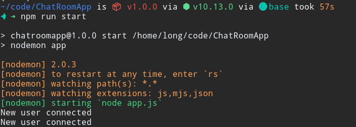

# Practical exercise for Chapter 3
Student name: Doan Cao Thanh Long

Student ID: 20162513

Class: ICT-02.k61

### Question 1: Which file just appears inthe folder ChatRoomApp? What is it used for?

### Question 2:
The content on the webpage

### Question 3:
Nothing happened because there is no user connect yet.

### Question 4:
The content on the console log

### Question 5:
Chat screen between 2 users (2 window tabs). It can easily be seen that the chat app is working.

